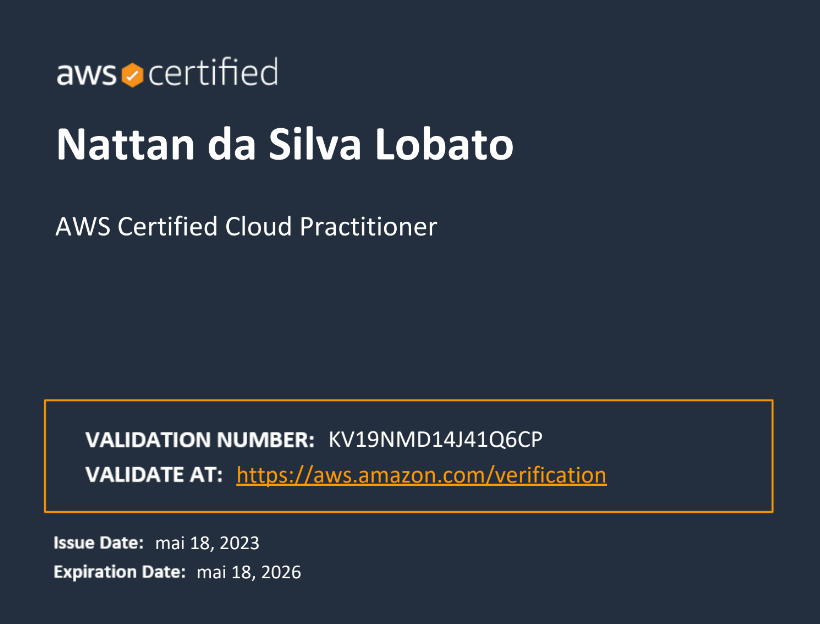

# README SOBRE MIM 

## Apresentação Pessoal
Olá, meu nome é **Nattan da Silva Lobato**, nascido em 10 de junho de 2000, na cidade de **Oriximiná**. Sou estudante universitário na U**niversidade Federal do Oeste do Pará - UFOPA**, campus Oriximiná, onde faço parte da turma do ano de 2018 do curso de **Bacharelado em Sistemas de Informação**.

Tive contato com computação bem cedo, o que contribuiu com minha paixão pela mesma e meu objetivo de seguir carreira na área. 

🍜😊 *Gosto de macarrão e música...* 😊🎧

## Experiência profissional e educacional

### Inicio
Minha carreira profissional iniciou-se no ano de 2017 na empresa da minha família, na qual fiquei até o ano de 2022, onde eram feitos serviços de gráfica, papelaria e lan house, além de alguns serviços de manutenção de computadores e notebooks que eram feitos por mim. Alguns dos serviços feitos são:
- Formatação de documentos;
- Criação de folhetos, cartões de visita, capas, etc;
- Pesquisas na internet;

Com essa experiência, tive a oportunidade de aprender a utilizar algumas ferramentas, como Office, programas de edição de imagem, pesquisas na internet, entre outros. Considero que a principal contribuição que essa experiência me trouxe foi aprender como organizar os trabalhos que devem ser feitos e como tratar diferentes tipos de clientes para criar relações com eles, obtendo assim clientes frequentes.

### Faculdade
Em 2018 iniciei meus estudos na UFOPA, no curso de Bacharelado em Sistemas de Informação, onde tive a oportunidade de participar de diversas atividades que contribuíram com meu desenvolvimento pessoal e profissional, como:
- Monitoria de disciplina;
- Auxílio na aplicação de formulários de pesquisa;
- Projetos de automação;
- Projeto de iniciação científica.

Através dessas atividades, os principais aprendizados adquiridos foram de organizar meus estudos, formas de buscar na internet e em livros os conteúdos que eram necessários e aprimorar minha capacidade de criar e analisar algoritmos.

### Compass
Através da universidade tive a oportunidade de participar de um programa de bolsas na empresa **Compass.uol**, no qual participei da trilha **Front-end Development (React) - AWS Cloud Context**, onde pude estudar algumas tecnologias, como:
- Cyber Security; 
- Git/Github;
- Desenvolvimento básico para web;
- ReactJS;
- AWS.

Ao final do programa, tive a oportunidade de obter a certificação **AWS Cloud Practitioner**;

## Projetos e Trabalhos
Ao longo dos ultimos anos, participei de alguns projetos, principalmente feitos na universidade e em cursos. Alguns deles são:

### Desenvolvimento do Back-end do aplicativo
Este foi um projeto de PIBIC, cujo objetivo principal era a criação de um algoritmo de Visão Computacional capaz de realizar a extração de caracteristicas e classificação de imagens para a catalogação de diferentes espécies de sapos.

### Projetos de desenvolvimento web
Outros projetos que foram feitos são voltados para a web. A maioria destes projetos foram idealizados em cursos e tiveram como objetivo praticar a contrução de sites e uso de algumas tecnologias. Alguns dos projetos são:
- [ViaCEP](https://github.com/nattanslobato/viaCEP)
- [Pokédex](https://github.com/nattanslobato/mc-react-pokedex) - ([https://genuine-bombolone-0a08ab.netlify.app](https://genuine-bombolone-0a08ab.netlify.app))
- [Rick and Morty](https://github.com/nattanslobato/ocean-frontend) - ([https://ocean-frontend-2023.onrender.com](https://ocean-frontend-2023.onrender.com))

### Furnas
Atualmente sou bolsista PIBIC em um projeto para a empresa Eletrobras Furnas, onde está em desenvolvimento um Modelo Probabilistico para previsão de consumo de energia elétrica no Brasil. Algumas das atividades que estou responsável são:
- Realizar testes de performance do projeto;
- Realizar buscas de ferramentas para agregar no projeto;
- Fazer análise e otimização do código do projeto e de suas dependências;

## Habilidades e Competências

- Python
- JS
- HTML
- CSS
- SQL

## Informações de Contato
|Contato|Link|
|---|---|
|GitHub|[nattanslobato](https://github.com/nattanslobato)|
|LinkedIn|[Nattan Lobato](www.linkedin.com/in/nattan-lobato-a64a95252)|
|Instagram|[nattanlobatoev](https://www.instagram.com/nattanlobatoev/)|